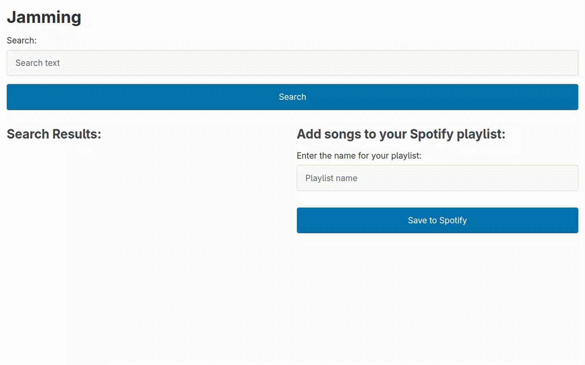

# Learning React

## Project Requirements

- Users can search for songs by song title.
- You can also include functionality to search by other attributes like artist’s name, genre, etc.
- Users can see information about each song like title, artist, and album for songs they queried
- You can also include other information – the design is up to you
- Users can export their custom playlist to their personal Spotify account

## What actually works

The search is implemented, but to implement the 'save playlist' feature, you need a back-end app, so I didn't do it.



## Installation instructions

First, you need `npm i` to install the dependencies, then you need [register your Spotify app](https://developer.spotify.com/documentation/web-api/concepts/apps) and create `.env` file with the following:

```bash
VITE_CID=<your client ID from Spotify>
VITE_CSECRET=<your client secret from Spotify>
VITE_BASEURL=https://accounts.spotify.com/api/token
VITE_SEARCHURL=https://api.spotify.com/v1/search
VITE_USERURL=https://api.spotify.com/v1/me
```
